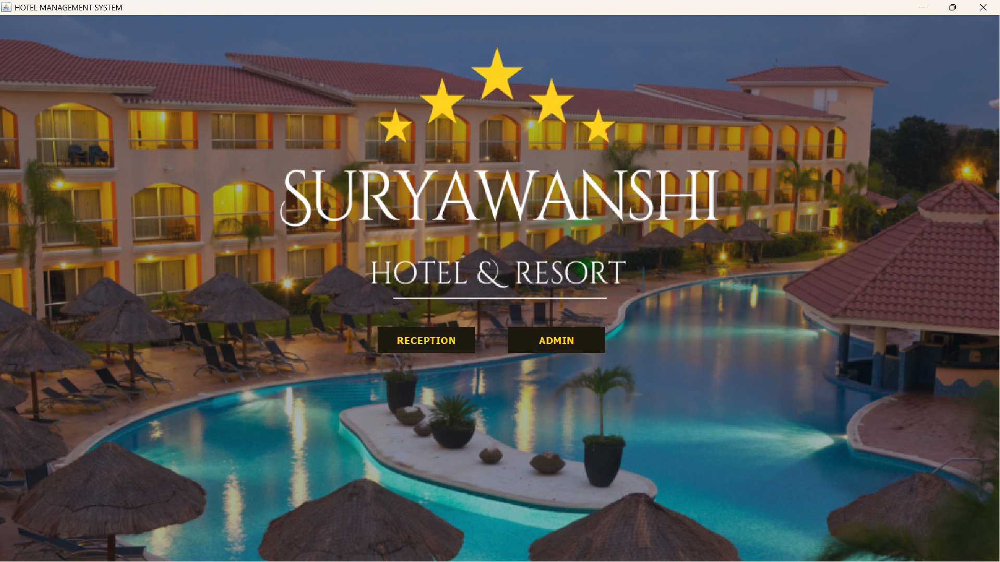
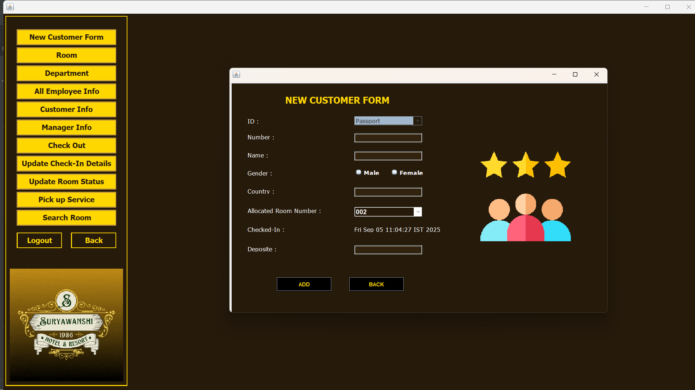
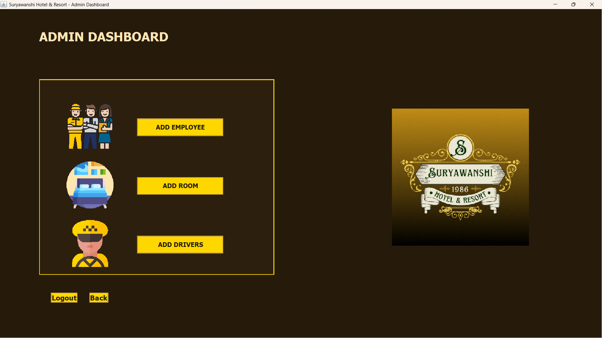
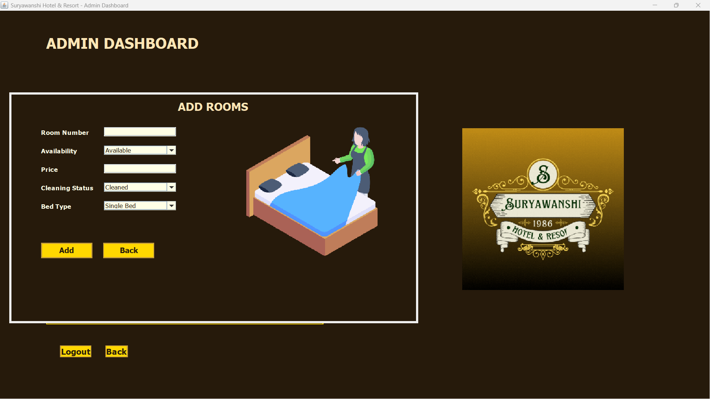

# 🏨 Hotel Management System
This is a comprehensive desktop application developed in Java for managing hotel operations. It provides a user-friendly graphical interface to handle various aspects of hotel administration, including employee, customer, and room management, as well as managing services like pickup.

---

## 📌 Table of Contents
- <a href="#features">Features</a>
- <a href="#tools-technologies">Tools & Technologies</a>
- <a href="#project-structure">Project Structure</a>
- <a href="#screenshots">Screenshots</a>
- <a href="#prerequisites">Prerequisites</a>
- <a href="#setup-installation">Setup & Installation</a>
- <a href="#author-contact">Author & Contact</a>

---

<h2><a class="anchor" id="features"></a>Features</h2>

- **Login & User Authentication:** Secure login for different user roles (e.g., admin and reception).
- **Employee Management:** Add new employees with details such as name, age, job title, and contact information. View a list of all employees and managers.
- **Room Management:** Add new rooms with details like room number, availability, cleaning status, price, and bed type. View all room information and search for rooms based on specific criteria.
- **Customer Management:** A form to add new customer details, including ID, room number, and check-in time. View a list of all customers, and manage check-out and payment updates.
- **Driver & Pick-up Service:** Manage drivers and their car details. View and search for available drivers.
- **Database Connectivity:** The application is connected to a MySQL database to store and retrieve all hotel data.

---

<h2><a class="anchor" id="tools-technologies"></a>Tools & Technologies</h2>

- **Java:** for the application logic.
- **Swing:** for building the graphical user interface (GUI).
-	**MySQL:** to store all the data.
-	**JDBC (Java Database Connectivity):** to connect the Java application to the MySQL database.

---

<h2><a class="anchor" id="project-structure"></a>Project Structure</h2>

```
Hotel_Management_System
├── src
│   ├── Hotel_Management_System
│   │   ├── AddEmployee.java
│   │   ├── AddRoom.java
│   │   ├── addDriver.java
│   │   ├── admin.java
│   │   ├── CheckOut.java
│   │   ├── conn.java
│   │   ├── CustomerInfo.java
│   │   ├── Dashboard.java
│   │   ├── Department.java
│   │   ├── Employee.java
│   │   ├── Login.java
│   │   ├── Login2.java
│   │   ├── ManagerInfo.java
│   │   ├── NewCustomer.java
│   │   ├── PickUp.java
│   │   ├── Reception.java
│   │   ├── Room.java
│   │   ├── SearchRoom.java
│   │   ├── Splash.java
│   │   ├── UpdateCheck.java
│   │   ├── UpdateRoom.java
│   ├── icons
│   │   ├── Dashboard1.png
│   │   ├── customer.png
│   │   ├── login.gif
│   │   ├── updated.png
│   │   ├── update.png
│   │   ├── roomm.png
│   │   └── etc.
├── lib
│   ├── mysql-connector-java-x.x.x.jar
│   ├── rs2xml.jar
└── README.md

```

---

<h2><a class="anchor" id="screenshots"></a>Screenshots</h2>









---

<h2><a class="anchor" id="prerequisites"></a>Prerequisites</h2>

**To run this project, you need to have the following installed:**
-	Java Development Kit (JDK) 8 or later.
-	MySQL Server.
-	A MySQL JDBC Driver (Connector/J) to establish database connection.

---

<h2><a class="anchor" id="setup-installation"></a>Setup & Installation</h2>

1. **Clone the Repository**
2. **Database Setup:**
   - Open MySQL and create a new database. The connection code (conn.java) suggests the database name is hotelMS.
   - Create the necessary tables. Based on the code, you'll need tables for customer, employee, room, driver, department, and login.
3. **Configure Database Connection:**
   - Open the conn.java file and update the database URL, username, and password to match your MySQL setup.
   - Ensure the MySQL JDBC driver JAR file is included in your project's classpath.
4. **Run the Application:**
   - Open the project in your preferred IDE (e.g., IntelliJ, Eclipse).
   - Run the Splash.java file, which serves as the main entry point for the application.
  
---

<h2><a class="anchor" id="author-contact"></a>Author & Contact</h2>

**Nayan Sunil Suryawanshi** 
 📧 Email: nayansuryawanshi289@gmail.com
 🔗 [LinkedIn](https://www.linkedin.com/in/nayan-suryawanshi-22a8a4251/) 

---


